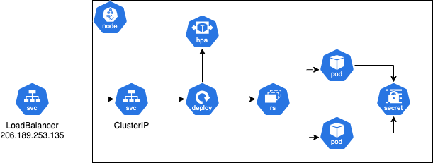
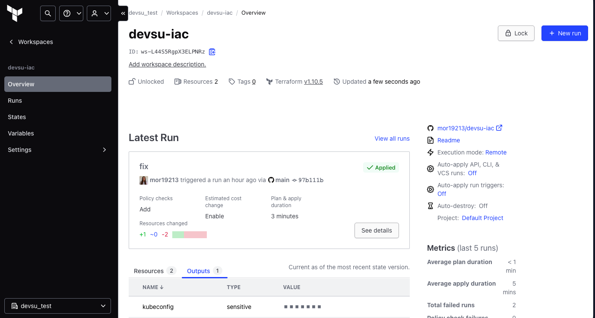
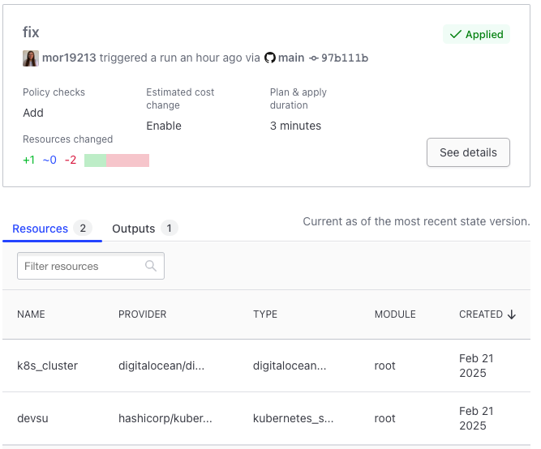
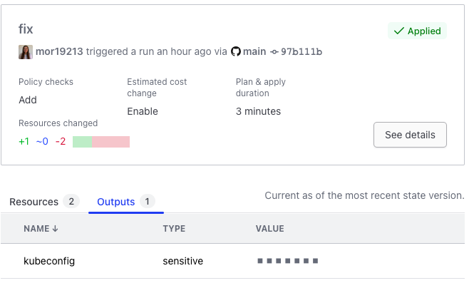
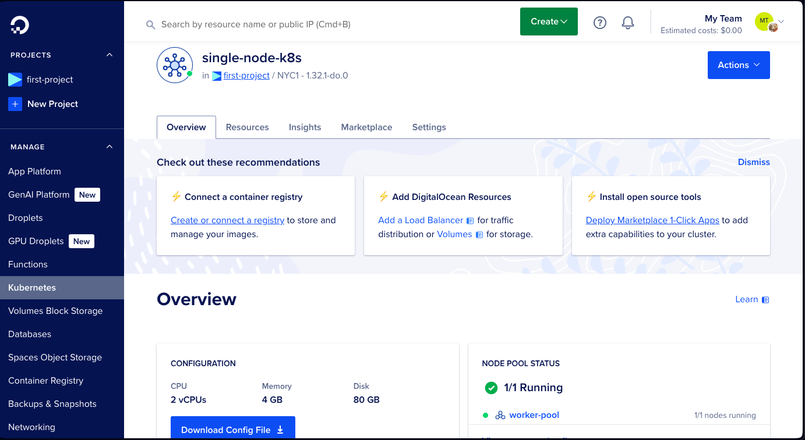
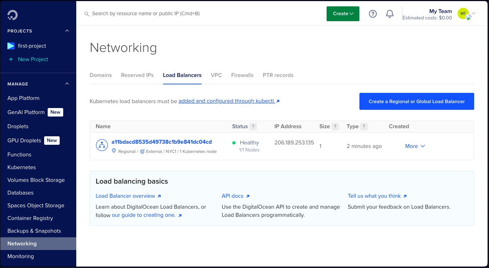

# Prueba para DevOps en Devsu de Daniela Morales Ponce

## Diagramas
### Arquitectura

### Terraform Cloud

### Recursos en Digital Ocean

## Especificaciones

### Contenedor
Se desarrolló el `Dockerfile` con multi-stage para que la imagen final ocupe menos espacio. Una etapa para hacer toda la instalación de las dependencias y otra etapa para el despliegue de la aplicación

### Pipeline
Se utilizó GitHub Actions para crear el pipeline de CI/CD a través de workflows reusables definidos en el [repositorio de workflows](https://github.com/mor19213/workflow-templates). Se desarrolló una etapa de seguridad con análisis de código estático con CodeQL (el cual exporta la covertura a un HTML) y análisis de vulnerabilidades con Trivy, una etapa de testing unitario con el módulo de tests nativo de Django, una etapa de Linting con Flake8, una etapa de build de la imágen de Docker, una etapa de push al registry de GitHub y la última etapa despliega con Helm el componente a Kubernetes

### Helm
Se creó un chart de Helm en la carpeta microservice-chart, con el cual se despliegan todos los manifiestos de Kubernetes.
- Deployment
- Service
- HPA
- Secrets
- Ingress (este todavía no se utiliza, pero se dejó para un caso productivo)

### IaC
Todo el código de Terraform está en el [repositorio de IaC](https://github.com/mor19213/workflow-templates)
- Se utilizó Terraform para definir y configurar la infraestructura como código
- Se utilizó Terraform Cloud para poder hacer el `terraform plan` y `terraform apply` y al mismo tiempo guardar el estado de Terraform. Para esto, se creó una cuenta gratuita, un workspace, se conectó con GitHub y se configuraron las variables (como el token de Digital Ocean para poder desplegar)

### Entorno Público
Se utilizó la nube pública Digital Ocean para desplegar la infraestructura, dentro de la cual se desplegó
- Cluster de Kubernetes
- Load Balancer (para tener una [IP pública](http://206.189.253.135/api/))